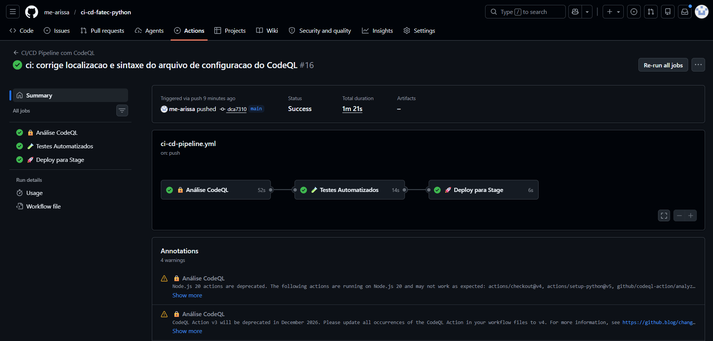

# Projeto CI/CD com GitHub Actions

Este repositório contém uma pipeline que executa:
1. Análise de segurança com CodeQL
2. Testes unitários e validação de estilo
3. Etapa de deploy (simulada)

## Evidências

